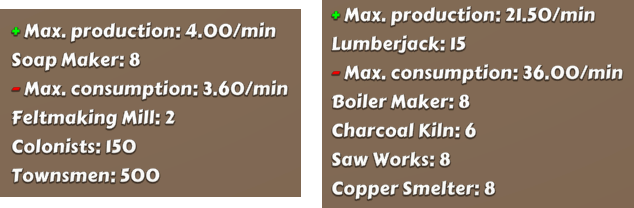

# Paragon Pioneers 2 Production Stats

This is a [BepInEx](https://github.com/BepInEx/BepInEx) plugin for [Paragon Pioneers 2](https://paragonpioneers.com/) that aims to show some more detailed item production and consumption statistics.

## Current features

Currently, the mod adds some text to the island storage screen detailing how much of a given item is produced and consumed on the current island and by what (see image below). Statistics are collected from the following sources:

- Resource production buildings (buildings that harvest crops or trees or gather resources from multiple fields also take into account the number of available fields);
- Unit production buildings;
- Population need buildings that consume resources;
- Resource doubling buildings;
- Population.

Note that resource consumption by shipyards and palaces is not shown.

## Installation

**Note:** The mod has only been tested on the Paragon Pioneers 2 Steam version on Windows, with BepInEx installed manually. However, there are mod loaders that can make installation easier.

1. Install [BepInEx](https://docs.bepinex.dev/articles/user_guide/installation/index.html) version 5.x;
2. Download the latest mod version from Releases;
3. Place the `PP2ProductionStats.dll` file in the `BepInEx/plugins` directory.

## Development

Requirements:

- .NET SDK.

To build the project locally, you will need to point the project to some game DLLs. Instructions can be found as comments in the project file `PP2ProductionStats.csproj`.